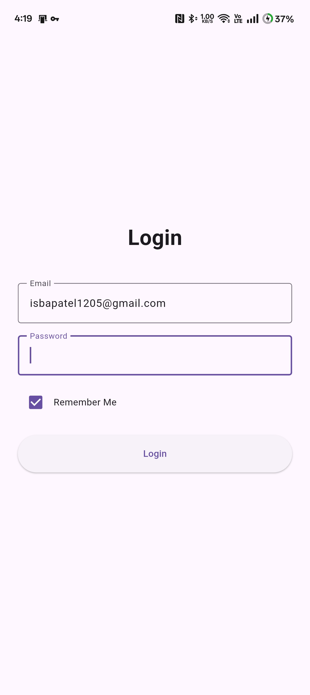
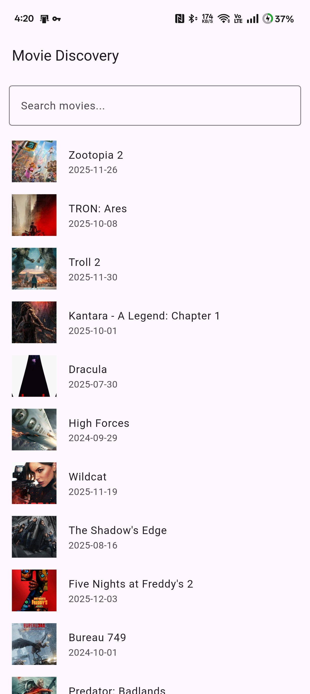
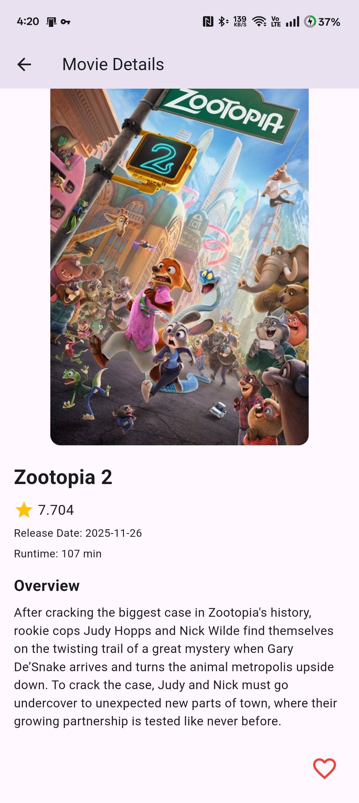

#🎬 Movie Discovery App

##Flutter application for browsing movies using TMDB API with BLoC architecture and local persistent favorites.

   
 
   

⭐ Tech Stack
Technology	Description
Flutter	Cross-platform framework
BLoC + Equatable	State management architecture
HTTP	API integration
Shared Preferences	Local storage & login state
TMDB API	Movie data provider
🚀 Features
Feature	Description
🎬 Movie Fetching	Popular movies from TMDB API
🔍 Search	Search by movie name
🔄 Pagination	Infinite scrolling + load more
🎞 Movie Detail Page	Ratings, genres, overview, release date
❤️ Favorites	Save locally using SharedPrefs
🔑 Login	Email & password validation + remember me
💫 Splash Screen	Gradient + animation & auto authentication check
↕ Pull-to-refresh	Refresh movie list
🧠 Clean Architecture	Folder-based structure with BLoC

🧠 Project Architecture
lib/
│
├── core/
│   ├── constants/          # App strings, API constants
│   ├── theme/              # App color definitions
│   └── utils/              # Validators & helpers
│
├── data/
│   ├── models/             # Movie & movie detail models
│   └── services/           # API service & SharedPrefs wrapper
│
├── logic/
│   ├── auth/               # Auth BLoC, events & states
│   └── movies/             # Movie list & detail BLoC
│
└── presentation/
    ├── screens/            # UI screens
    └── widgets/            # Reusable widgets

##🌐 API
The Movie Database (TMDB)
https://www.themoviedb.org/

##⚠ Important Note
Some Indian ISPs (e.g., Jio / BSNL) block TMDB API requests.
If movies do not load, enable VPN (Recommended: Cloudflare WARP).

##📦 Installation
📥 Clone repository
git clone https://github.com/isbapatel/movie-discovery.git
cd movie_discovery

##📦 Install dependencies
flutter pub get

##▶ Run app
flutter run

##📱 Build release APK
flutter build apk --release

APK Path:
build/app/outputs/flutter-apk/app-release.apk

##📸 Screenshots

   
 
   

##📥 APK Download
🔗 Google Drive Link:https://drive.google.com/file/d/1t-u8trYyPBhrFvuWVOqkW8M_PcirP39Q/view?usp=drive_web

##🧠 Future Improvements
Hero animations for smooth transitions
Shimmer loading effect
Offline support with local caching
Review & Cast section
Recommendation system
Dark & Light theme switching
Firebase authentication

##✨ Developed By
Isba Patel
Computer Science Undergraduate | Flutter & AI/ML Developer
📍 Pune, India
📧 isbapatel1205@gmail.com

🔗 GitHub: https://github.com/isbapatel
